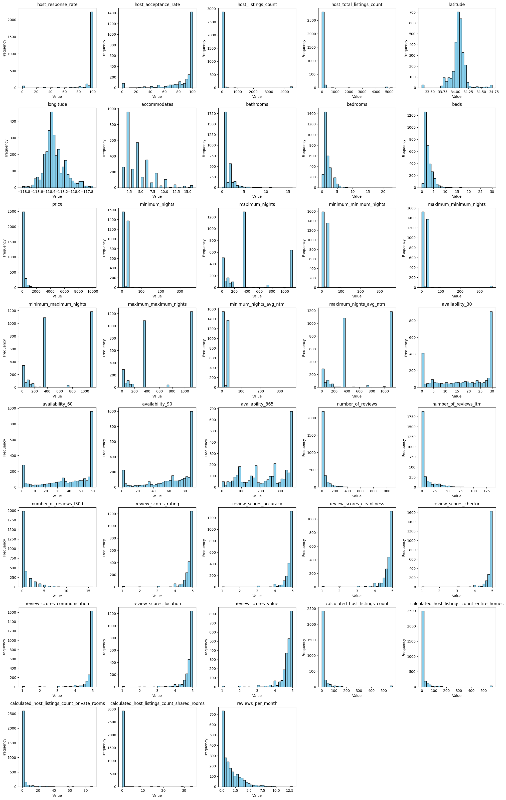

# Airbnb Booking Days Prediction Project

This repository contains a detailed analysis and predictive modeling project aimed at forecasting the number of days an Airbnb listing in Los Angeles will be booked in the next 30 days. Below, you’ll find an overview of the project, methodologies, results, and actionable insights.

---

## Table of Contents for the Jupyter Notebook ([airbnb_booking_days_prediction.ipynb](airbnb_booking_days_prediction.ipynb))
1. [Introduction](#1)
2. [Library Import](#2)
3. [Data Import and Basic Preprocessing](#3)
4. [Data Split](#4)
5. [Exploratory Data Analysis (EDA)](#5)
   - 5.1 [Data Overview](#5.1)
   - 5.2 [Numerical Features](#5.2)
     - A) [Drop Useless Numerical Features](#5.2.A)
     - B) [Plot Histograms for Numerical Features](#5.2.B)
     - C) [Plot Scatter Plots for Numerical Features Against 'Days Booked'](#5.2.C)
     - D) [Transformations](#5.2.D)
   - 5.3 [Categorical Features](#5.3)
     - A) [Hand-Pick Useful and Relevant Categorical Features](#5.3.A)
     - B) [Tag Informative Missing Values](#5.3.B)
6. [Preprocessing and Transformations](#6)
7. [Define Functions for Comparing Results](#7)
   - 7.1 [Save and Compare R² Scores for the Models](#7.1)
   - 7.2 [Save and Compare Cross-Validation Results](#7.2)
8. [Baseline Model](#8)
9. [Ridge and Hyperparameter Tuning](#9)
10. [Elastic Net and Hyperparameter Tuning](#10)
11. [Check Permutation Importance](#11)
12. [More Feature Engineering](#12)
    - 12.1 [Discretize Nights and Availability 30](#12.1)
    - 12.2 [Check Latitude and Longitude Residuals](#12.2)
    - 12.3 [Check Price and Bedrooms Residuals](#12.3)
    - 12.4 [Assembling More Features (More Discretization and Interaction Terms)](#12.4)
13. [Compare Model Performance After More Feature Engineering](#13)
14. [Non-Linear Model: Random Forest and Hyperparameter Tuning](#14)
15. [Permutation Importance for the Best Model](#15)
16. [Final Prediction](#16)
17. [Insights and Recommendations](#17)
    - 17.1 [Observations from Feature Importance](#17.1)
    - 17.2 [Key Insights](#17.2)
    - 17.3 [Actionable Recommendations](#17.3)
      - A) [For Airbnb Owners in LA](#17.3.A)
      - B) [For Airbnb as a Platform](#17.3.B)
18. [Improvements](#18)

---

## 1. Data Source
The data for this project is sourced from [Inside Airbnb](https://insideairbnb.com/los-angeles/), providing extensive information about Airbnb properties listed in Los Angeles, California. The dataset includes over 70 features related to listings, hosts, and booking patterns. For a detailed understanding of the data, refer to the data dictionary here: [link](https://docs.google.com/spreadsheets/d/1iWCNJcSutYqpULSQHlNyGInUvHg2BoUGoNRIGa6Szc4/edit?gid=1322284596#gid=1322284596).

## 2. Goal
Unlike the common focus on predicting listing prices, the primary goal of this project is to **predict the number of days a given Airbnb listing will be booked in the next 30 days**. This shift aims to provide actionable insights for hosts and the platform to optimize booking performance.

## 3. Challenge
The dataset contains over 70 features, and it is unclear which are most relevant for predicting booking days. This necessitates multiple rounds of feature engineering to identify and prioritize the most impactful variables, addressing issues like multicollinearity, missing data, and feature relevance.

## 4. Techniques Used
- **Data Preprocessing Techniques**: Imputing missing values, normalization, discretization, clamping outliers, log transformation, one-hot encoding, missing indicator, checking residuals, and creating interaction terms.
- **Building Data Transformation Pipelines**: Streamlined workflows for consistent preprocessing across models.
- **Regularization**: Ridge and Elastic Net to handle overfitting and feature selection.
- **Cross Validation**: To ensure robust model evaluation.
- **Hyperparameter Tuning**: GridSearchCV for optimizing model parameters.
- **Feature Importance**: Permutation importance to assess feature contributions.
- **Self-Defining Functions**: Custom functions for comparing and visualizing results.

## 5. First Round of Data Preprocessing and Feature Engineering
### 5.1 Data Overview
Initial exploration of the dataset reveals its structure, including feature types and distributions, setting the stage for targeted preprocessing.

### 5.2 Numerical Features
#### 5.2.1 Drop Useless Numerical Features
Certain numerical features, such as `id`, columns with minimal variance (e.g., `calendar_updated`), and the target column (`days_booked`), provide little predictive value and are dropped from the training set.

#### 5.2.2 Plot Histograms for Numerical Features

Histogram analysis highlights distribution patterns, identifying features requiring transformation:
- Features like `beds`, `bedrooms`, and `bathrooms` have low cardinality and are treated as **discrete**.
- Maximum and minimum nights features show clustering and outliers, warranting clamping to 30 and 365 days.
- Features like `price`, `number_of_reviews`, and `calculated_host_listings_count` exhibit right-skewed distributions, benefiting from log transformation.

### 5.3 Categorical Features
- Hand-Picked useful and relevant categorical features include `property_type`, `room_type`, `neighbourhood_cleansed`, `instant_bookable`, `host_is_superhost`, `host_identity_verified`, `host_has_profile_pic`, `host_response_time`, and `host_verifications` due to their non-textual nature and manageable complexity (unlike amenities).
- Tag informative missing values in `neighborhood_overview`, `last_review`, and `host_about` to indicate lower trustworthiness or popularity.

### 5.4 Data Transformation
The identified transformations are assembled into a **ColumnTransformer** to create a consistent preprocessing pipeline. This pipeline is used to build a baseline model, followed by regularization techniques (Ridge and Elastic Net) to reduce overfitting and improve test set performance. Hyperparameter tuning with GridSearchCV optimizes model parameters.

## 6. Baseline Model, Ridge and Elastic Net with Hyperparameter Tuning
- A baseline model is established using the initial preprocessing pipeline to provide a reference point for subsequent improvements. But the gap between train and test R² scores is too large, indicating overfitting.
- Ridge and Elastic Net are applied with hyperparameter tuning to balance model complexity and performance, reducing overfitting. Elastic net stands out with the highest test R² score.
- Permutation importance is calculated to evaluate the contribution of each feature to the model's predictions.

## 7. Second Round of Feature Engineering
- **Discretize Nights and Availability 30**: To introduce nonlinearity, additional discretization is applied to features like minimum_nights, availability_30, and others, based on their importance scores.
- **Add Interaction Terms for Latitude and Longitude**: Residual analysis of latitude and longitude suggests potential nonlinear relationships, prompting the creation of interaction terms.
- **Add Interaction Terms for Price and Bedrooms**: Similar analysis for price and bedrooms indicates nonlinear interactions, leading to additional feature engineering.

## 8. Non-Linear Model: Random Forest with Hyperparameter Tuning
A Random Forest model is explored for its ability to handle nonlinear relationships, sensitivity to outliers, and built-in feature importance. Hyperparameter tuning is conducted to optimize performance.

## 9. Model Selection
The project evaluated multiple models, with performance metrics (R² scores) provided below for train and test sets:

| Model         | Linear Regression | Ridge  | Elastic Net | Elastic Net 2 | Random Forest |
|---------------|-------------------|--------|-------------|---------------|---------------|
| **Train**     | 0.284392          | 0.246037 | 0.241600    | 0.251292      | 0.580813      |
| **Test**      | 0.181947          | 0.223522 | 0.225277    | 0.223712      | 0.254365      |

Additionally, cross-validation results:
- Mean Test Score: Linear Regression (0.216175), Ridge (0.216902), Elastic Net (0.219403), Random Forest (0.229249)
- Std Test Score: Linear Regression (0.010494), Ridge (0.010908), Elastic Net (0.01124), Random Forest (0.01124)
- Params: Model-specific hyperparameters (e.g., Ridge alpha: 417.53189365604004, RF max_depth: 10, max_features: 0.1)

The Random Forest model outperformed others on the training set (0.580813), though its test performance (0.254365) indicates some overfitting. Its cross-validation mean score (0.229249) suggests it generalizes better than linear models, making it the preferred choice.

## 10. Insights and Recommendations
### 10.1 Observations from Feature Importance from the Best Model
- **Most Important Features**:
  | Category          | Feature                            | Importance  |
  |-------------------|------------------------------------|-------------|
  | Guest Engagement  | Number of Reviews                 | 0.017971    |
  | Guest Engagement  | Number of Reviews LTM             | 0.017780    |
  | Availability      | Availability_60                   | 0.013940    |
  | Availability      | Availability_90                   | 0.011775    |
  | Availability      | Availability_30                   | 0.008913    |
  | Guest Engagement  | Reviews per Month                 | 0.008624    |
  | Stay Rules        | Minimum Nights                    | 0.005177    |
  | Host Metrics      | Calculated Host Listings Count (Entire Homes) | 0.004620 |
  | Guest Satisfaction| Review Scores Value               | 0.004369    |
  | Availability      | Availability_365                  | 0.004075    |
  | Guest Satisfaction| Review Scores Communication       | 0.004058    |
  | Guest Satisfaction| Review Scores Check-in            | 0.003777    |
  | Guest Satisfaction| Review Scores Location            | 0.003672    |
  | Pricing           | Price                             | 0.003523    |
  | Guest Satisfaction| Review Scores Cleanliness         | 0.003362    |
  | Guest Engagement  | Number of Reviews L30D            | 0.003031    |
  | Guest Satisfaction| Review Scores Rating              | 0.002993    |

- **Least Important Features**:
  | Category          | Feature                            | Importance  |
  |-------------------|------------------------------------|-------------|
  | Host Metrics      | Calculated Host Listings Count    | -0.000011   |
  | Stay Rules        | Maximum Nights                    | -0.000040   |
  | Host Metrics      | Host Listings Count               | -0.000062   |
  | Guest Satisfaction| Review Scores Accuracy            | -0.000116   |
  | Host Profile      | Host Has Profile Pic              | -0.000152   |
  | Host Profile      | Host Identity Verified            | -0.000220   |
  | Host Profile      | Host About                        | -0.000394   |
  | Host Responsiveness| Host Response Rate                | -0.000592   |
  | Booking Logistics | Instant Bookable                  | -0.001187   |
  | Host Responsiveness| Host Response Time                | -0.002024   |
  | Location          | Neighbourhood Cleansed            | -0.002765   |

### 10.2 Key Insights
- **Reviews and Activity Rule**: Listings with high and recent review counts signal trust and demand, driving bookings.
- **Availability is a Lever**: Short-term availability (30-90 days) is critical, reflecting LA’s spontaneous travel trends.
- **Quality Supports, Doesn’t Lead**: Review scores (value, communication, check-in) matter but are secondary to engagement and availability.
- **Price is Contextual**: It influences decisions but is secondary to perceived value.
- **Host Profile and Logistics Fade**: Features like host profile details or instant booking have minimal impact.

### 10.3 Actionable Recommendations
#### A) For Airbnb Owners in LA
- **Maximize Review Volume and Recency**: Prompt guests for reviews post-stay and highlight recent feedback.
- **Keep Short-Term Availability High**: Open calendars for 30-90 days, adjusting dynamically.
- **Optimize Minimum Nights**: Set to 1-2 nights to attract more guests.
- **Prioritize Value and Operations**: Price competitively, streamline check-ins, and enhance communication.
- **Highlight Entire-Home Strengths**: Market privacy and unique features of entire homes.
- **Don’t Over-Focus on Profile or Instant Booking**: Focus on listing quality over minor host traits.

#### B) For Airbnb as a Platform
- **Boost Review Engagement**: Automate review requests and gamify guest participation.
- **Refine Availability Tools**: Provide dashboards to optimize 30-90 day availability.
- **Promote Value-Driven Pricing**: Enhance Smart Pricing with review score integration.
- **Simplify Guest Experience Metrics**: Focus host education on communication and value.
- **Rethink Instant Booking Push**: Offer more control over instant booking options.
- **Downplay Neighborhood Granularity**: Emphasize broader LA appeal in marketing.

## 11. Improvements
While the Random Forest model provided the best performance, there are several areas for improvement to enhance predictive accuracy and generalization:

1. **More Hyperparameter Tuning for Random Forest**:
   - The Random Forest model shows signs of overfitting (train R²: 0.580813, test R²: 0.254365). Expand hyperparameter tuning using GridSearchCV to explore a wider range of parameters, such as increasing `min_samples_split`, reducing `max_depth`, or adjusting `max_features`, to improve generalization and reduce the train-test performance gap.

2. **Explore Other Non-Linear Models**:
   - Test additional non-linear models like XGBoost and LightGBM, which often handle complex datasets well and may outperform Random Forest. Compare their performance using the same cross-validation framework to identify if they offer better generalization or higher test R² scores.

3. **Enhanced Feature Engineering with Amenities**:
   - The `amenities` column contains complex textual data (e.g., lists of features like "Wi-Fi," "parking," "pool"). Process this column by extracting key amenities through text parsing or NLP techniques (e.g., tokenization, one-hot encoding of common amenities). This could uncover valuable predictors, especially for non-linear models like Random Forest or XGBoost, which can capture intricate patterns.

4. **Incorporate NLP on Text Columns**:
   - The current model only uses numerical and categorical features, ignoring text columns like listing descriptions or host bios. Apply NLP techniques (e.g., TF-IDF, word embeddings) to these columns to extract sentiment, keywords, or thematic elements (e.g., "luxury," "cozy"). This could improve model performance by capturing qualitative factors that influence bookings.

---

## Conclusion
This project successfully predicts Airbnb booking days in LA, with the Random Forest model offering the best performance after extensive feature engineering and hyperparameter tuning. The insights highlight the importance of reviews, availability, and guest experience, providing a roadmap for hosts and Airbnb to optimize bookings. Future improvements, such as deeper hyperparameter tuning, testing additional models, and leveraging textual data, could further enhance predictive power.
